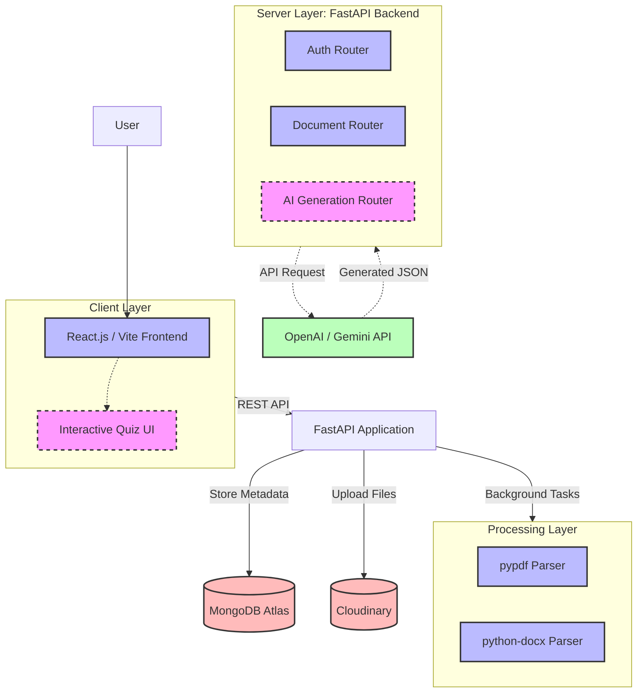
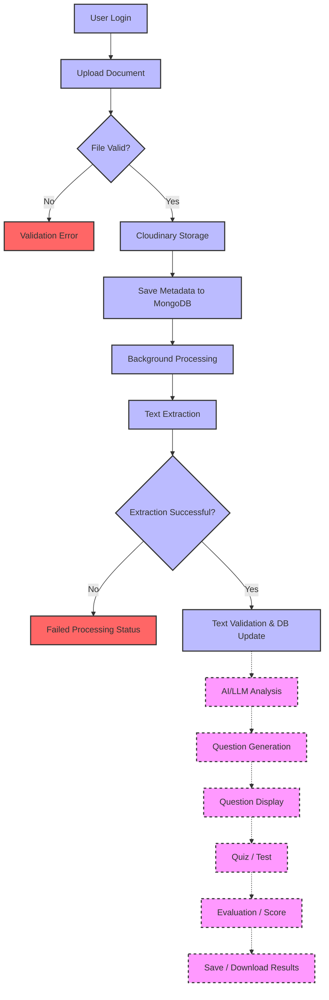
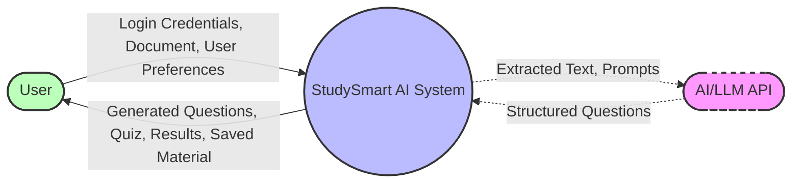
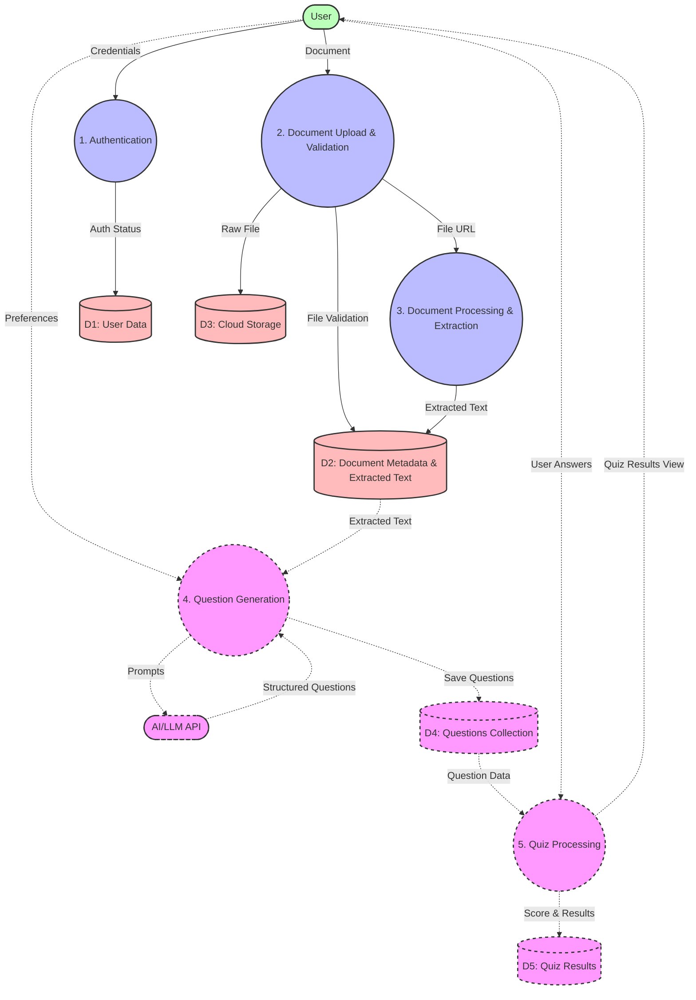
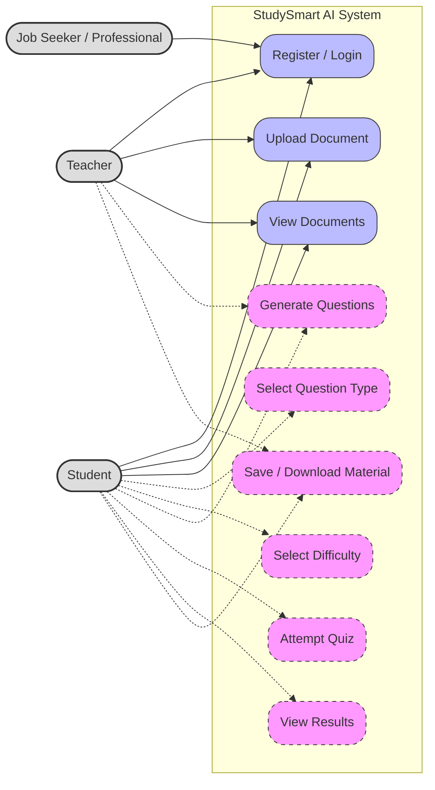
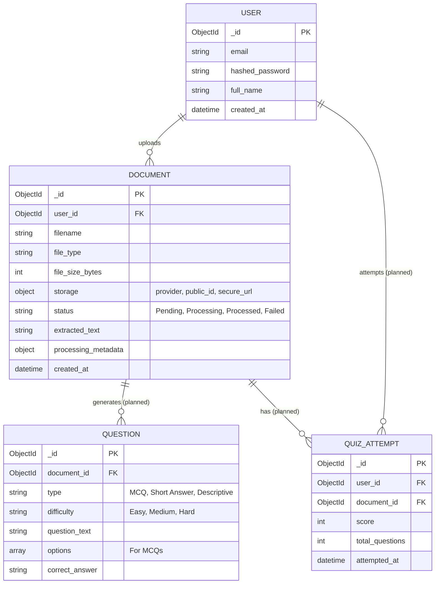
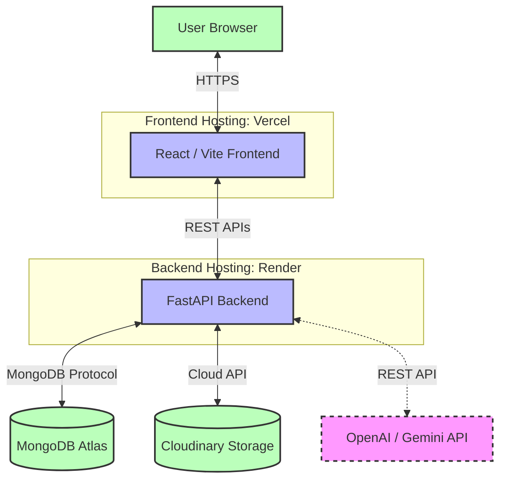

# Recommended Synopsis Diagrams for StudySmart AI

The following diagrams should be created and included in your final academic synopsis to visually support the textual content. They accurately reflect the current implementation while explicitly indicating planned modules.

### 1. System Architecture (High-Level Design) Diagram
*   **Placement:** Under Section 4.1 (System Architecture)
*   **Purpose:** To illustrate the overall client-server architecture, the separation of concerns, and interactions with external cloud services and APIs.
*   **Components to Include:**
    *   **Client Layer:** React.js / Vite Frontend (UI, Upload Forms, Quiz Interface `[Planned]`).
    *   **Server Layer:** FastAPI Backend (Auth Router, Document Router, AI Generation Router `[Planned]`).
    *   **Processing Layer:** Background Task Engine, Document Parsers (`pypdf`, `python-docx`).
    *   **Data & Storage Layer:** MongoDB Atlas (NoSQL Database), Cloudinary (Cloud File Storage).
    *   **External APIs:** OpenAI or Gemini API `[Planned]`.

### 2. System Workflow Diagram
*   **Placement:** Under Section 4.2 (End-to-End System Workflow)
*   **Purpose:** To show the chronological, step-by-step flow of how the system processes a document from upload to final quiz generation.
*   **Steps to Include:**
    1.  User Uploads Document (PDF/DOCX).
    2.  Backend Validates File & Uploads to Cloudinary.
    3.  Background task extracts text from the document.
    4.  Extracted text is saved to MongoDB (Status: Processed).
    5.  Backend constructs an AI prompt and queries the LLM API `[Planned]`.
    6.  System receives and parses structured questions `[Planned]`.
    7.  User attempts the interactive quiz and receives a score `[Planned]`.

### 3. Data Flow Diagram (DFD) – Level 0 & Level 1
*   **Placement:** After Section 4.2 or within Section 4.5 (Data Management)
*   **Purpose:** To map how specific data payloads (files, extracted text, AI prompts) move between processes and data stores.
*   **Components to Include:**
    *   **External Entities:** User, AI/LLM Provider `[Planned]`.
    *   **Processes:** Authenticate User, Store Document, Extract Text, Generate Questions `[Planned]`, Evaluate Quiz `[Planned]`.
    *   **Data Stores:** Users Collection, Documents Collection, Questions Collection `[Planned]`, Quiz Results Collection `[Planned]`.
    *   **Data Flows:** Raw File, File URL, Extracted Text, User Preferences (Difficulty/Type), Prompts, Structured Questions JSON, User Answers, Score.

### 4. Use Case Diagram
*   **Placement:** Under Section 3.7 (Target Users / Use Cases)
*   **Purpose:** To define the system functionalities available to the primary actors.
*   **Components to Include:**
    *   **Actors:** User (representing Student, Teacher, Professional).
    *   **Use Cases:** Register/Login, Upload Document, View Uploaded Documents, Delete Document, Generate Quiz `[Planned]`, Take Quiz `[Planned]`, View Past Results `[Planned]`, Download Questions `[Planned]`.

### 5. Entity-Relationship (ER) / Data Model Diagram
*   **Placement:** Under Section 4.5 (Data Management)
*   **Purpose:** To detail the NoSQL document schemas and the logical relationships (via ObjectIds) between entities in MongoDB Atlas.
*   **Entities & Fields to Include:**
    *   **User:** `_id`, `email`, `hashed_password`, `full_name`, `created_at`.
    *   **Document:** `_id`, `user_id` (Reference to User), `filename`, `file_type`, `storage` (provider, public_id, secure_url), `status` (Pending, Processing, Processed, Failed), `extracted_text`, `processing_metadata`.
    *   **Question** `[Planned]`**:** `_id`, `document_id` (Reference to Document), `type` (MCQ, Short Answer, etc.), `difficulty`, `question_text`, `options` (Array for MCQs), `correct_answer`.
    *   **QuizAttempt** `[Planned]`**:** `_id`, `user_id`, `document_id`, `score`, `total_questions`, `attempted_at`.

---

# Mermaid Diagram Codes

## 1. System Architecture / HLD

## 2. End-to-End System Workflow

## 3. DFD Level 0

## 4. DFD Level 1

## 5. Use Case Diagram

## 6. Logical Data Model / ER Diagram

## 7. Deployment Architecture

# Diagram Verification Notes

*   **System Architecture / HLD:** Represents the high-level decoupled architecture. Validated against the current FastApi/React setup and `pypdf`/`python-docx` implementations. The AI generation router and Quiz UI are explicitly marked as planned.
*   **End-to-End System Workflow:** Maps the chronological execution flow. The upload, Cloudinary upload, MongoDB metadata creation, and background extraction tasks are implemented. AI analysis, question generation, and quiz features are marked as planned.
*   **DFD Level 0:** Represents the system boundary and external entities. The AI/LLM Provider is marked as a planned external dependency.
*   **DFD Level 1:** Details the specific data stores and major processing steps. The `Users` and `Documents` collections are verified from the current backend models. The `Questions` and `Quiz Results` collections are planned extensions.
*   **Use Case Diagram:** Defines actor interactions with the system. Uploading and viewing documents are implemented. All quiz and AI generation interactions are properly marked as planned.
*   **Logical Data Model / ER Diagram:** The `USER` and `DOCUMENT` entities accurately reflect the current `app.models` schema. The `QUESTION` and `QUIZ_ATTEMPT` entities are logical predictions based on the approved project scope and are marked as planned relationships.
*   **Deployment Architecture:** Represents the planned production deployment using Vercel (Frontend) and Render (Backend) as instructed in the project guidelines, interacting with MongoDB Atlas and Cloudinary APIs.
